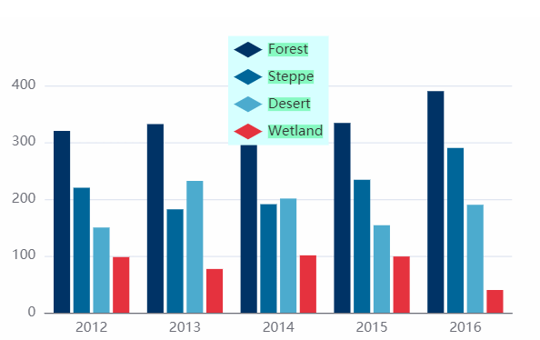

# 01 ECharts常用配置

### 基础项配置

1、 **title**     标题组件，包含主标题和副标题。 

> #### `title.show = true`
>
> 是否显示标题组件。

> #### `title.text = ''`
>
> 标题文本，支持使用 `\n` 换行。

>`title.subtext = ''`
>
>副标题文本，支持`\n`换行。

> `title.textAlign = 'auto'`
>
>  整体（包括 text 和 subtext）的水平对齐。 
>
>  可选值：`'auto'`、`'left'`、`'right'`、`'center'`。 

> ```css
> //设置字体样式，可适用于任何部分
> textStyle: {
>       fontSize: 30;
>       color: '#000'；
>       textBorderColor: '#ccc', //文字本身的描边颜色。
>       textShadowColor: '#ddd', //文字本身的阴影颜色。
>       ......
>     },
>     subtextStyle: {
>       fontSize: 20，
>       ...... //同上
>     }
> ```
>
> 

2、**legend**  图例组件

> `legend.type = ''`
>
> 图例类型
>
> 可选值：`plain` 普通图例。缺省就是普通图例 。
>
> ​			 `scroll`  可滚动翻页的图例。当图例数量较多时可以使用 。

> #### `legend.show = true`
>
> 是否显示图例组件。
>
> 

> ```css
> legend: {
>     type: "plain", //图里类型。可选值 'plain' 普通图例。缺省就是普通图例 。'sroll'可滚动翻页的图例。当图例数量较多时可以使用 。
>     top: "5%", //图例组件离容器顶部的距离。
>     orient: "vertical"， //图例列表的布局朝向。'horizontal':横向； 'vertical'：纵向；
>     align: "left"， /图例标记与文本对齐方式  'auto,left,right'
>     itemGap: 10, //图例之间间隔
>     itemWidth: 25，//图例宽度
>     itemHeight: 14， //图例高度
>     inactiveColor: "#ccc", //图例关闭时的颜色
>     icon: "arrow", //图例项的 icon。'circle', 'rect', 'roundRect', 'triangle', 'diamond', 'pin', 'arrow', 'none'，可以通过 'image://url' 设置为图片，其中 URL 为图片的链接，或者 dataURI。
>     backgroundColor: "#d6ffff",//图例背景色
>     textStyle: {
>       backgroundColor: "#86f9c1", //文字块背景色
>       ......
>     },
>     //图例的 tooltip 配置，配置项同 tooltip，默认不显示。
>     tooltip: {
>         show: true
>     },
>   },
> ```
>
> ```js
> //图例的数据数组
> data: [{
>     name: '系列1',
>     // 强制设置图形为圆。
>     icon: 'circle',
>     // 设置文本为红色
>     textStyle: {
>         color: 'red'
>     }
> }]
> ```
>
> 

3、**grid**   直角坐标系内绘图网格 

>  单个 grid 内最多可以放置上下两个 X 轴，左右两个 Y 轴。可以在网格上绘制**折线图**，**柱状图**，**散点图（气泡图）**。 

```JS
grid: {
    //grid 组件离容器四周的距离
    left: "4%",
    top: "5%",
    right: "5%",
    bottom: "5%",
    borderColor: "rgba(65, 255, 138, 1)"，//边线颜色
    //containLabel: true，//grid 区域是否包含坐标轴的刻度标签。
  },
```


4、**xAxis** 直角坐标系 grid 中的 x 轴 

> - 坐标轴可选类型
> - `'value'` 数值轴，适用于连续数据。
> - `'category'` 类目轴，适用于离散的类目数据。为该类型时类目数据可自动从 [series.data](https://echarts.apache.org/zh/option.html#series.data) 或 [dataset.source](https://echarts.apache.org/zh/option.html#dataset.source) 中取，或者可通过 [xAxis.data](https://echarts.apache.org/zh/option.html#xAxis.data) 设置类目数据。
> - `'time'` 时间轴，适用于连续的时序数据，与数值轴相比时间轴带有时间的格式化，在刻度计算上也有所不同，例如会根据跨度的范围来决定使用月，星期，日还是小时范围的刻度。
> - `'log'` 对数轴。适用于对数数据。

```js
xAxis: [{
    type: "category", //坐标轴类型
    data: ["Mon", "Tue", "Wed", "Thu", "Fri", "Sat", "Sun"],//x轴数据
    name: "坐标轴名称",  //坐标轴名称。
    //坐标轴名称的文字样式。
    nameTextStyle: {
        align: 'left',//文字水平对齐方式
        verticalAlign: 'top',//文字水平对齐方式，可选：'top'、'middle'、'bottom'
        color: "rgba(96, 252, 161, 1)",//颜色
    },
    nameGap: 16, //坐标轴名称与轴线之间的距离。
    inverse: false,//是否是反向坐标轴
    min: 10, //坐标轴刻度最小值。
    max: 800, //坐标轴刻度最大值。
    scale: false, //只在数值轴中（type: 'value'）有效。是否是脱离 0 值比例。设置成 true 后坐标刻度不会强制包含零刻度。在双数值轴的散点图中比较有用。在设置 min 和 max 之后该配置项无效。
    minInterval: 10, //自动计算的坐标轴最小间隔大小
    //坐标轴轴线相关设置。
    axisLine: {
        symbol: "arrow", //轴线两边的箭头
    },
    axisLabel: {
              interval: 0,
              rotate: 40, //x轴文字旋转
             textStyle: {
                 fontFamily: 'Microsoft YaHei',
                 color: "#000",
             }
         },
  }],
```


5、**yAxis** 直角坐标系 grid 中的 y 轴 

> 基本配置项同x轴

```js
yAxis: [{
    type: "value",
    show: true,
    position: "left", //y轴位置，left  or  right
    axisLine: {
      show: true, //坐标轴线
    }，
    axisTick: {
      show: true,  //刻度线（短线）
    inside: false, //坐标轴刻度是否朝内，默认朝外。
    length: 5, //线长度
    },
  }],
```

> 一般情况下单个 grid 组件最多只能放左右两个 y 轴，多于两个 y 轴需要通过配置 [offset](https://echarts.apache.org/zh/option.html#yAxis.offset) 属性防止同个位置多个 Y 轴的重叠。 

```js
 yAxis: [
        {
            type: 'value',
            name: '水量',
            min: 0,
            max: 250,
            interval: 50,
            axisLabel: {
                formatter: '{value} ml'
            }
        },
        {
            type: 'value',
            name: '温度',
            min: 0,
            max: 25,
            interval: 5,
            axisLabel: {
                formatter: '{value} °C'
            }
        }
    ],
```


6、**series** 系列列表 

```js
series: [{
             name: '第一柱',
             type: 'bar',
             barWidth: '15%',
             itemStyle: {
                 normal: {//配置渐变柱子
                     color: new echarts.graphic.LinearGradient(0, 0, 0, 1, [{
                         offset: 0,
                         color: '#95CAFF'
                     }, {
                         offset: 1,
                         color: '#2676FF'
                     }]),
                 }
             },
             data: [10, 20, 30, 40, 50]
         }
     ]
```


> 注意： 将完整的 echarts 引入后，图表能正常展示。加上渐变后就会报错：“echarts is not defined“。
>
> 应在本页面中引入 `import echarts from 'echarts/lib/echarts'`


